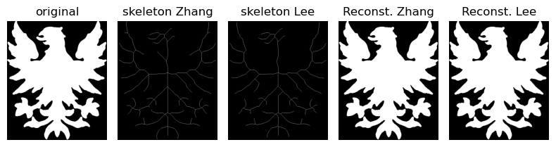

Skeletonization Methods comparison
===

Skeletonization is a process used in image processing to reduce binary images to their skeletal form, preserving the structure while minimizing the amount of data. This project analyzes two popular skeletonization methods: Zhang and Lee. The aim is to implement, compare, and evaluate the effectiveness of these methods.

## Methodologies
- Zhang Method

The Zhang method, also known as the Zhang-Suen thinning algorithm, is an iterative method that progressively removes pixels from the boundaries of objects in a binary image. The goal is to preserve the topological properties of the image, such as connectivity and shape.

- Lee Method

The Lee method is another iterative thinning algorithm designed to produce a skeleton of the image by successively removing pixels from the boundary. This method focuses on preserving the connectivity and reducing the image to a minimal representation while maintaining the essential structure.

## Dataset Description

The dataset used for this project consists of binary images that include various shapes and structures to evaluate the skeletonization methods. These images are chosen to represent different complexities and challenges in the skeletonization process.

## Results comparison



## Install the environment in a local device
The following steps must be followed to install the dependencies required for running the application:

1. Navigate to the project directory
```
cd (`project_path`)
```

2. Create a conda environment from a .yml file
```
conda env create -f environment.yml
```

## Dependencies
The main libraries used in this project include:

- OpenCV
- NumPy
- Matplotlib
- scikit-image

## Evaluation
The evaluation process includes:

- Qualitative analysis: Visual comparison of the skeletonized images produced by both methods.
- Quantitative analysis: Using metrics such as:
    - Reconstruction error
    - Topology preservation (euler number)
    - Approximation of the medial axis
    - Invariance to similarity transformation
    - Coverage of true medial axis
    - Unit-width, irreducibility
    - Graph analysis: number of end points, number of T-points, number of X-points
    - Skeleton size (number of pixels of the skeleton)
    - Skeleton length (sum of distance between neighboring pixel along paths)
    - Ratio of skeleton size to skeleton length
    - Approximation of end points to the border of the shape
